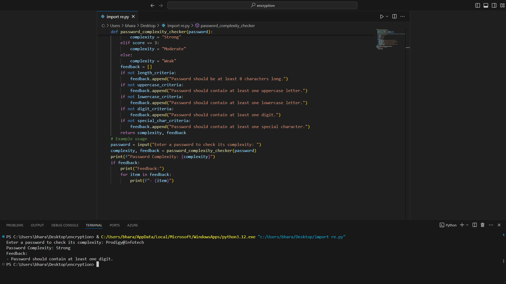
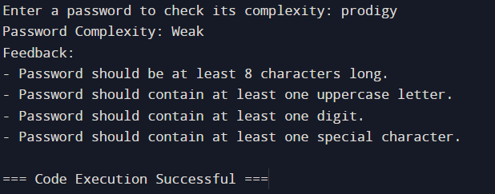

# password-complexity-checker-by-PYTHON

This script evaluates a password based on several criteria such as length, the presence of uppercase and lowercase letters, numbers, and special characters. It assigns a score based on these criteria and provides feedback on the strength of the password.

Password complexity checkers are essential tools in cybersecurity, aiming to assess the strength and security of passwords. Here’s an in-depth look at their importance, how they work, and related information.

# Importance of Password Complexity Checkers
  Security Enhancement:

Protection Against Attacks: Strong passwords are vital to protect against brute-force attacks, where attackers try various combinations to guess the password. Complex passwords significantly increase the time and computational power required for such attacks.

Defense Against Common Passwords: Users often choose simple and common passwords that are easy to remember but also easy to guess. Complexity checkers encourage users to create more secure passwords.

Compliance:

Regulatory Requirements: Many industries have regulations that mandate strong password policies. Complexity checkers help ensure compliance with these standards.

Company Policies: Organizations often have internal policies requiring employees to use strong passwords. Automated checkers enforce these policies consistently.

User Education:

Awareness: By providing feedback on password strength, these tools educate users on the importance of strong passwords and what constitutes a secure password.

Best Practices: They teach users to incorporate various character types and avoid common patterns.

# How Password Complexity Checkers Work

Criteria Evaluation:

Length: Passwords need to be of sufficient length, typically 8 characters or more, to be considered strong.

Character Variety: Checkers evaluate the presence of uppercase letters, lowercase letters, digits, and special characters.

Pattern Detection: Some advanced checkers can detect common patterns, dictionary words, and repeated characters, providing warnings about these weak elements.

Scoring System:

Simple Scoring: Basic checkers assign scores based on the number of criteria met.

Advanced Scoring: More sophisticated systems use algorithms to evaluate entropy (randomness) and overall complexity, providing a more nuanced score.

Feedback Mechanism:

Real-Time Feedback: As users create passwords, checkers provide instant feedback on the strength and suggestions for improvement.

Educational Tips: They often include tips and guidelines on creating strong passwords.
Best Practices for Creating Strong Passwords
Length: Aim for at least 12-16 characters.

Character Variety: Use a mix of uppercase letters, lowercase letters, digits, and special characters.

Avoid Common Patterns: Don’t use easily guessable information like "password123" or "qwerty."
Passphrases: Consider using a combination of random words to create a memorable but complex passphrase.

Unique Passwords: Use different passwords for different accounts to prevent a single breach from compromising multiple services.

Password Managers: Utilize password managers to generate and store complex passwords securely.
Tools and Libraries for Password Complexity Checking

# Python Libraries:

zxcvbn: A popular library for estimating password strength, considering a wide range of factors.

passlib: A comprehensive password hashing library that includes complexity checking.

re: Regular expressions in Python can be used to create custom complexity checkers.

Online Tools:

Have I Been Pwned: Checks if a password has been compromised in data breaches.

Password Meter: An online tool providing a detailed assessment of password strength.


# BASIC SYNTAX 
 
 password_complexity_checker
 
 Import the recommended thing like 're'(regural expresstion)
 
 Criteria for checking password complexity(length,upper,lower,digit,special_char criteria s)
 
 calculate the complexity score 
 
 provide feedback based on the score
 
 example usage
 
 complexiry , feedback =password_complexity_checker(password)
 

```

import re

def password_complexity_checker(password):
    # Criteria for checking password complexity
    length_criteria = len(password) >= 8
    uppercase_criteria = re.search(r'[A-Z]', password) is not None
    lowercase_criteria = re.search(r'[a-z]', password) is not None
    digit_criteria = re.search(r'[0-9]', password) is not None
    special_char_criteria = re.search(r'[\W_]', password) is not None

    # Calculate the complexity score
    score = sum([length_criteria, uppercase_criteria, lowercase_criteria, digit_criteria, special_char_criteria])

    # Provide feedback based on the score
    if score == 5:
        complexity = "Very Strong"
    elif score == 4:
        complexity = "Strong"
    elif score == 3:
        complexity = "Moderate"
    else:
        complexity = "Weak"

    feedback = []
    if not length_criteria:
        feedback.append("Password should be at least 8 characters long.")
    if not uppercase_criteria:
        feedback.append("Password should contain at least one uppercase letter.")
    if not lowercase_criteria:
        feedback.append("Password should contain at least one lowercase letter.")
    if not digit_criteria:
        feedback.append("Password should contain at least one digit.")
    if not special_char_criteria:
        feedback.append("Password should contain at least one special character.")

    return complexity, feedback

# Example usage
password = input("Enter a password to check its complexity: ")
complexity, feedback = password_complexity_checker(password)

print(f"Password Complexity: {complexity}")
if feedback:
    print("Feedback:")
    for item in feedback:
        print(f"- {item}")

```


# after execution 

<p align="center">
<b>Root User</b>
<br/>
  
<br/>
<br/>
</p>

If in case the password is weak the following conditions will de displayed  and if the 
conditons are satesfied then the password will be strong

<p align="center">
<b>Root User</b>
<br/>
  
<br/>
<br/>
</p>
